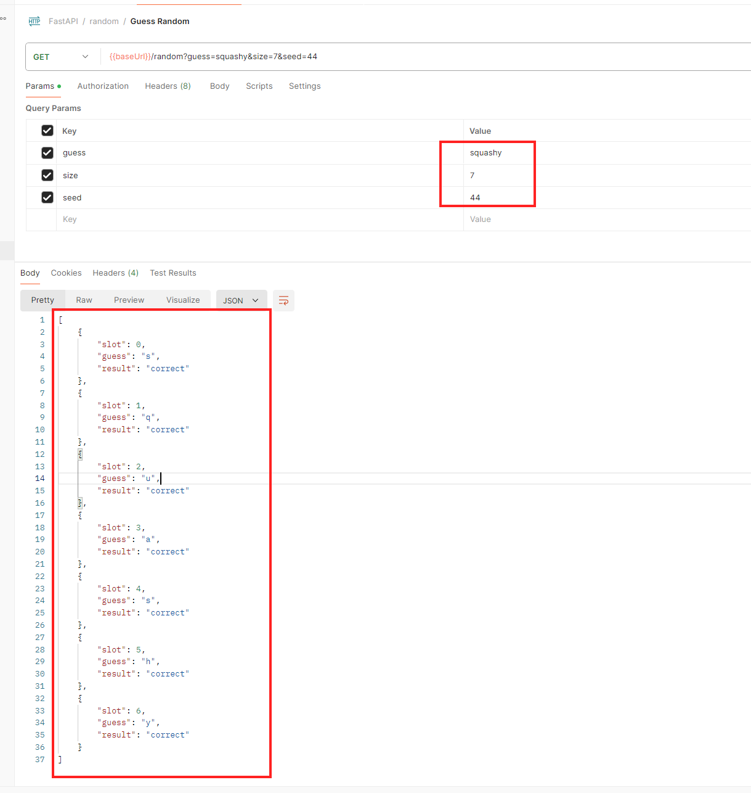

# Write a program that automatically guesses random words.

Reviewer:  jacky@votee.com and king.wu@votee.com


### Reference 
```
Tool/IDE: VScode, Postman, Google Colab: https://colab.research.google.com/
Language: Python
Lib: request, string, collections
AI: ChatGPT and Claude
```

**Link of the code**: https://colab.research.google.com/drive/1AtezTmDIXnxRkWy8_ZUYCSxUKVUShifR?usp=sharing

## How to run 

### 1. Goto Google Colab: https://colab.research.google.com/


### 2. Click to run the code

- **Choose puzzle type: daily or random**


- **Enter the word length**


- **Result**


## Random case

- **Choose random**


- **Enter length and seed**


- **Result**


- **Test again with API**


